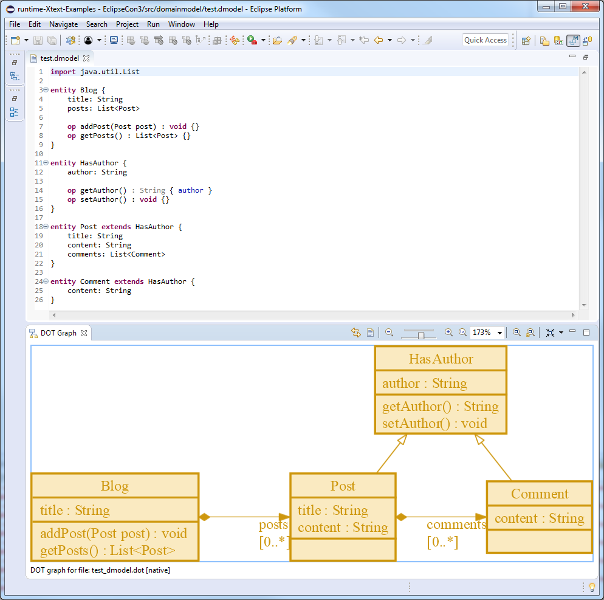

# Eclipse GEF DOT - Graphical Views on Xtext DSLs

The previous [blog post](https://blogs.itemis.com/en/editing-graphviz-.dot-files-with-the-gef-dot-editor) introduced some complex [Graphviz \*.dot](https://graphviz.gitlab.io/_pages/doc/info/lang.html) graphs to add Eclipse GEF DOT-based visualization support to the Eclipse IDE. This blog post demonstrates the usage of the Eclipse GEF DOT component to add graphical representations to Xtext DSLs.

The following examples are shipped with the Xtext framework and are available via the Xtext Example Wizard. They are extended by Model-to-Text transformations to generate intermediate Graphviz \*.dot files as inputs for the GEF DOT Graph View.

### Visualizing the Xtext Domain-Model Example

The Xtext Domain-Model Example describes an Entity language that allows the specification of real-world entities with their properties and their relations to each other. The [DomainmodelDotGeneratorTest](https://github.com/itemis/itemis-blog/blob/gef_graphical_views_on_xtext_dsls/DomainModelExample/org.eclipse.xtext.example.domainmodel.tests/src/org/eclipse/xtext/example/domainmodel/tests/DomainmodelDotGeneratorTest.xtend) test suite specifies how the different Entity DSLs should be translated to Graphviz DOT files.
```Xtend
@RunWith(XtextRunner)
@InjectWith(DomainmodelInjectorProvider)
class DomainmodelDotGeneratorTest {

	...

	@Test def test13() {
		'''
			import java.util.List

			entity Blog {
				title: String
				posts: List<Post>

				op addPost(Post post) : void { }
				op getPosts() : List<Post> {}
			}

			entity HasAuthor {
				author: String

				op getAuthor() { author }
				op setAuthor() : void {}
			}

			entity Post extends HasAuthor {
				title: String
				content: String
				comments: List<Comment>
			}

			entity Comment extends HasAuthor {
				content: String
			}
		'''.assertCompilesTo('''
			digraph {
				// layout=sfdp

				nodesep=1.2
				rankdir=BT

				node [shape=record style="filled, bold" color="#CE970D" fillcolor="#FAEAC1" fontcolor="#CE970D"]

				// nodes
				Blog [
					label = "{
						Blog|
						title : String\l|
						addPost(Post post) : void\lgetPosts() : List\<Post\>\l
					}"
				]
				HasAuthor [
					label = "{
						HasAuthor|
						author : String\l|
						getAuthor() : String\lsetAuthor() : void\l
					}"
				]
				Post [
					label = "{
						Post|
						title : String\lcontent : String\l|
					}"
				]
				Comment [
					label = "{
						Comment|
						content : String\l|
					}"
				]

				// inheritance edges
				edge[arrowhead=onormal color="#CE970D" fontcolor="#CE970D"]
				Post -> HasAuthor
				Comment -> HasAuthor

				// association edges
				edge[arrowhead=normal arrowtail=diamond dir=both constraint=false]
				Blog -> Post [headlabel="posts\n[0..*]"]
				Post -> Comment [headlabel="comments\n[0..*]"]
			}
		''')
	}

	...

}
```
Looking into the [DomainmodelDotGenerator](https://github.com/itemis/itemis-blog/blob/gef_graphical_views_on_xtext_dsls/DomainModelExample/org.eclipse.xtext.example.domainmodel/src/org/eclipse/xtext/example/domainmodel/generator/DomainmodelDotGenerator.xtend) confirms that each entity in the DSL file is translated into a DOT node, the entity's properties and operations are coded into the DOT node's record-based label, while the inheritance/association relationships are converted to DOT edges with corresponding arrowhead/arrowtail symbols.

```Xtend
class DomainmodelDotGenerator extends JvmModelGenerator {

	...

	override void doGenerate(Resource input, IFileSystemAccess fsa) {
		fsa.generateFile(input.fileName, (input.contents.head as DomainModel).toDot)
	}

	def toDot(DomainModel it) '''
		digraph {
			// layout=sfdp

			nodesep=1.2
			rankdir=BT

			«generateEntities»

			«generateInheritanceConnections»

			«generateAssociationConnections»
		}
	'''

	private def generateEntities(DomainModel it) '''
		node [shape=record style="filled, bold" color="#CE970D" fillcolor="#FAEAC1" fontcolor="#CE970D"]

		// nodes
		«FOR entity : entities»
			«entity.generate»
		«ENDFOR»
	'''

	private def generate(Entity it) '''
		«name» [
			label = "{
				«name»|
				«generateProperties»|
				«generateOperations»
			}"
		]
	'''

	...

	private def generateInheritanceConnections(DomainModel it) '''
		// inheritance edges
		edge[arrowhead=onormal color="#CE970D" fontcolor="#CE970D"]
		«FOR entity : entities»
			«IF entity.superType!==null»
				«entity.name» -> «entity.superType.simpleName»
			«ENDIF»
		«ENDFOR»
	'''

	private def generateAssociationConnections(DomainModel it) '''
		// association edges
		edge[arrowhead=normal arrowtail=diamond dir=both constraint=false]
		«FOR entity : entities»
			«FOR property : entity.associationProperties»
				«entity.name» -> «property.type.determineType.simpleName» [headlabel="«property.associationLabel»"]
			«ENDFOR»
		«ENDFOR»
	'''

	...

}
```
 As soon as the Xtext project is extended by the GEF DOT-based visualization support, the `Show In -> DOT Graph` context menu of the Xtext Editor opens the graphical representation of the Xtext DSL.



### Visualizing the Xtext Home Automation Example


### Visualizing the Xtext Simple Arithmetics Example


### Visualizing the Xtext State-Machine Example


All these examples are available on the corresponding [GitHub repository](https://github.com/itemis/itemis-blog/tree/gef_graphical_views_on_xtext_dsls). For further information, I suggest you to take a look at the [GEF DOT User Guide](https://github.com/eclipse/gef/wiki/DOT-User-Guide) or watch the recorded [GEF DOT session on the EclipseCon Europe 2018](https://www.eclipsecon.org/europe2018/sessions/eclipse-gef-dot-graphviz-authoring-environment-eclipse).
